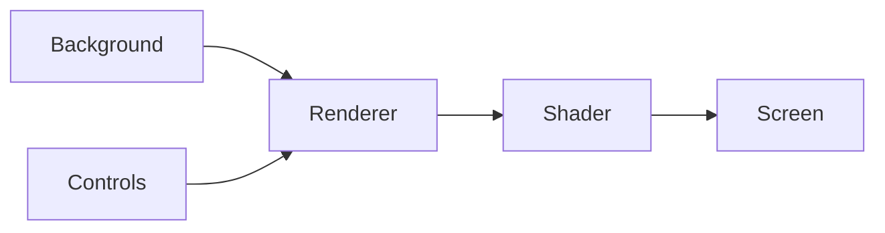

# Retinitis pigmentosa, as I see it

**Live: https://amitoze.github.io/rp-simulator/**

An artistic representation of one person's experience of retinitis pigmentosa (RP) — an inherited condition in which the retina's light-sensing cells slowly die, usually from the edges of vision inward.

## Why this exists

Existing low-vision simulators render RP as a clean black tunnel. That misses what the lost field can actually feel like from the inside — and in particular, none of them capture **photopsias**: the spontaneous light phenomena that ~93% of people with RP experience, concentrated exactly where vision has been lost (Bittner et al. 2009, 2012). This project adds that missing piece, built from a first-person description: the dead field as opaque smokey water with half-transparent patches, a persistent net of rapid flashes running through it, and a flickering ring at the edge of the surviving field.

The imagery was checked against the clinical literature where it exists — the degenerating retina generates a continuous ~10 Hz oscillation (Menzler & Zeck 2011), which sets the flicker rate used here. Where one person's experience diverges from the published surveys, the simulation stays faithful to the person. It is a portrait, not an average, and not a medical model.

> ⚠️ **Photosensitivity warning** — contains continuous rapid flashing at ~9 Hz.

## How it works

The world (camera or video) becomes a WebGL texture; a fragment shader decides, per pixel, whether it is seen, half-seen through the murk, or lost.



- **Background** — live camera, the bundled street video, or a procedural fallback scene
- **Controls** (`controls.js`) — sliders and toggles; feeds settings to the renderer every frame
- **Renderer** (`renderer.js`) — WebGL frame loop; turns the background into a texture
- **Shader** (`shader.frag`) — per pixel: field mask, smokey periphery, flashing net, edge ring
- **Screen** — immersive view, or a normal-vision comparison

Sliders control the size of the surviving field, the density of the flashing net, and how much shows through the periphery. Camera mode uses the rear camera on phones; comparison view shows normal vision alongside the simulation.

## Running locally

```bash
python3 -m http.server 8000
```

Then open http://localhost:8000/.

Street footage by [LOVE SHANGHAI](https://commons.wikimedia.org/wiki/File:Shanghai_March_2026_%E2%80%93_Magical_City_Spring_Walk_-_4K_HDR.webm), CC BY 4.0 — see [assets/CREDITS.md](assets/CREDITS.md).
